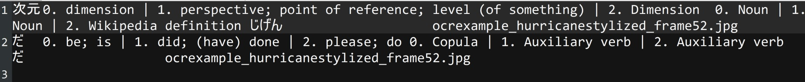
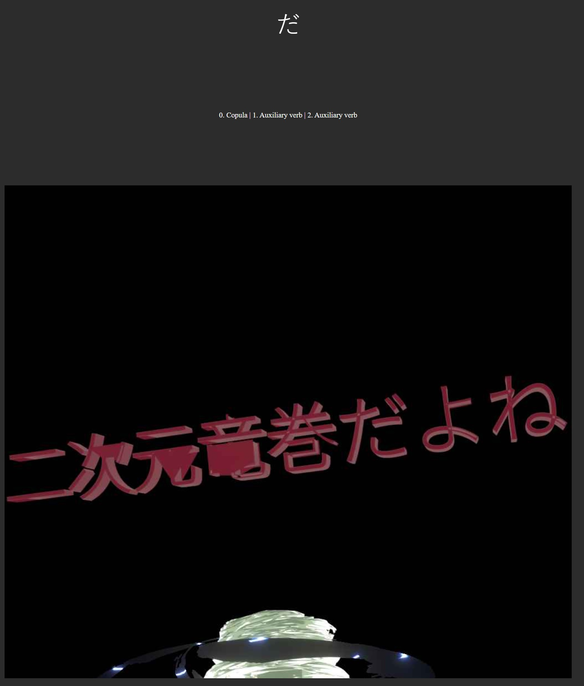
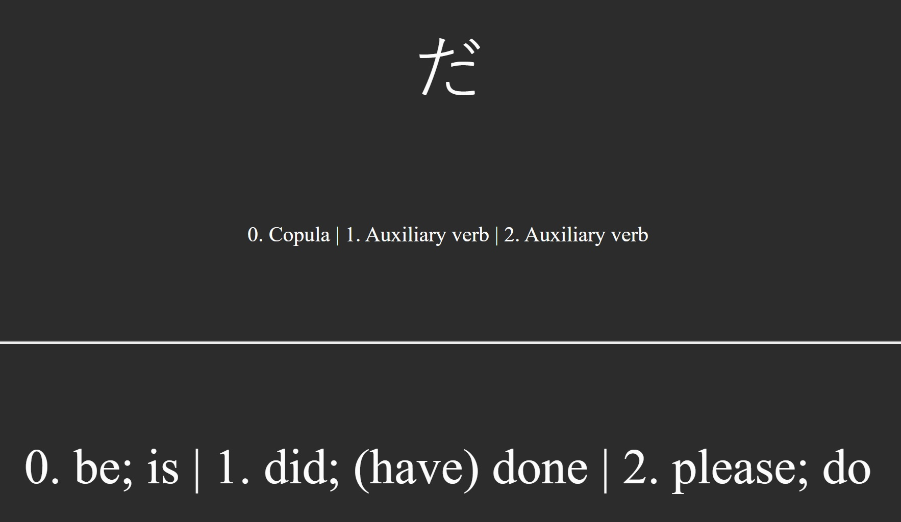

# Overview

Primarily in `analyze_image_sequence.py`, this repository provides functions supporting a workflow for building language-study [Anki](https://apps.ankiweb.net/) digital flash cards:

1. Begins with an image sequence (provided by user; an example image sequence is provided in `test/sequence_sample_images.zip`), where each image follows a convention with filenames ending in `fname<FRAMENUM>.<FILETYPE>`
2. An OCR system (currently supported: Google Vision, EasyOCR) is invoked to extract text from each image in the sequence
3. A Japanese tokenizer is used to split the text into tokens (currently supported: JumanPP)
4. Online dictionaries/translators (currently supported: Jisho) are accessed to identify possible definitions for each token
5. The token/definition pairs are written to a text file easily parsed by Anki deck imports

It also provides optional functionality for building (very conservative) confidence intervals to estimate which of the available OCR systems has the
highest accuracy for the user's target image sequence.

# Dependencies

The repository has a number of non-standard dependencies, notably:

1. [Fire](https://google.github.io/python-fire/guide/), for a convenient command-line interface, which allows functionality to be accessed like `python analyze_image_sequence.py FUNCTION_NAME --arg1=arg1val --arg2=arg2val`
2. [Python Google Vision API](https://codelabs.developers.google.com/codelabs/cloud-vision-api-python/#1), for use of Google's OCR neural nets (ala Google Lens). Because this is a commercial service, the user must also create a Google Cloud developer account, configure payment options, and obtain credentials, then modify `google_ocr.py` so that it knows where to find these. Concerning payment: as of May 11, 2024, the first 1000 uses per month of the Google Vision API are free, but pricing could of course change; anyone using the Google Vision API should consult [the Google Vision pricing page](https://cloud.google.com/vision/pricing) for current information
3. [EasyOCR](https://github.com/JaidedAI/EasyOCR), which provides a reasonably effective, free-and-open-source alternative to Google Vision. `analayze_image_sequence.py` can also use `EasyOCR` to filter images that likely contain no Japanese text, to reduce the number of calls to the Google Vision API
4. [JapaneseTokenizer](https://pypi.org/project/JapaneseTokenizer/), for convenient tokenizer interface, used in Step 3 (as well as JumanPP, for which the JapaneseTokenizer page provides installation instructions)
5. [cv2](https://pypi.org/project/opencv-python/), used in the optional CI estimation, to allow GUI user input on number of correct OCR extracts
6. [Noto Sans Japanese](https://fonts.google.com/noto/specimen/Noto+Sans+JP), the current font used in GUI display to the user when prompting for the number of correct OCR extracts, in building of confidence intervals. The relevant `.ttf` file is required in a folder within `fonts/`

# Slightly More Detailed Example/Walk-Through

Functions in this script are meant to be invoked from cmd-line via Fire. Simple example of processing pipeline, from OCR to Anki-importable txt:

1. `python analyze_img_sequence.py extract_text_from_img_sequence --filter_ocr="easy_ocr" --img_type="jpg"`
2. `python analyze_img_sequence.py tokenize_jp --read_file="test/STEP1_sequence_sample_images_small_dump.json" --write_file="test/STEP2_tokenized_sequence_sample_images_small_dump.json"`
3. `python analyze_img_sequence.py get_token_translations --read_file="test/STEP2_tokenized_sequence_sample_images_small_dump.json" --out_file="test/STEP3_tokens_translated_sample_images_small.json"`
4. `python analyze_img_sequence.py generateAnkiImportableTxt --read_file="test/STEP3_tokens_translated_sample_images_small.json" --write_file="test/STEP4_tokens_translated_anki_importable_sample_images_small.txt"`

After the main workflow is complete and an "Anki importable" txt is produced, for images to work properly in Anki, the source images in the STEP 1 `<target_folder>` should be copied to `%APPADATA%\Anki2\` for Windows, to `~/Library/Application/Support/Anki2/` for Mac, or to `~./local/share/Anki2/` for Linux. (These locations were taken from [the Anki file locations documentation](https://docs.ankiweb.net/files.html#file-locations) as of May 2024, so if they do not seem to work, it is possible Anki updated its storage locations.)

If successful, the output of Step 4 should be a file that looks like (though typically much larger than this, of course):

This can be imported as a deck into Anki via the usual `File->Import` Anki menu option. I don't provide sample Anki cards here, but here is an example of what the final cards might look like:

[//]: # ""

(front)

[//]: # ""

(back)

The format of these cards isn't unusual; you should be able to easily make your own following guides online. One small note is that I use Javascript to embed an image, like:

``

where `ImgContext` is the name given to the Anki `Field` corresponding to the final column of the Anki-importable txt produced by Step 4 above. You should make sure this is properly mapped when importing the Anki-importable txt into Anki, of course.

# Miscellaneous Notes

Import/card testing was performed with Anki version 24.04.1.
